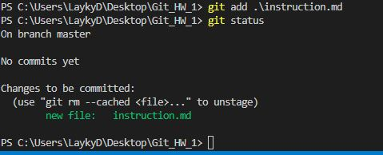

# Инструкция по работе с Git, используя Markdown

## Установка и настройка Git и Visual Studio Code

1. **Для установки ПО необходимо скачать и затем установить его:**
    - Установка Git для Windows, Mac, Linux: <https://git-scm.com/downloads>
    - Установка VSCode для Windows, Mac, Linux: <https://code.visualstudio.com/download>

2. **Настройка ПО:**

- В терминале необходимо прописать:

    *git --version*

- Если всё установлено правильно, должно быть что-то вроде: 

    *git version 2.34.1.windows*

    

- После этого нужно представиться GITу введя команды:

    *git config --global user.email "ВАШ email"*

    *git config --global user.name "ВАШЕ Имя"*

**Установка и настройка ПО завершены!**

## Работа с GIT

1. Cоздаем папку, в которой мы будем работать, например ***Git_HW_1***, запускаем VSC и открываем эту папку:

2. Нажимаем пункт меню ***Терминал - Создать терминал (Cntr+Shift+`)***. Открывется окно терминала:

3. В терминале вводим команду ***git init*** (команда инициализирует директорию в новый репозиторий Git) и получаем следующее сообщение:

4. Команда ***git status*** отображает состояние рабочего каталога и раздела проиндексированных файлов:

5. Создаем файл ***instruction.md*** в нашей папке и снова выполняем команду ***git status*** и видим, что у нас был создан файл и от нас требуются действия:

6. Вводим команду ***git add .\instruction.md*** (команда добавляет изменение из рабочего каталога в раздел проиндексированных файлов), после этого снова вводим ***git status*** и получаем следующее:

Также можно использовать команду ***git add --all*** (добавляет все измененные и неотслеживаемые файлы в репозиторий и обновляет дерево изменений репозитория).

7. Далее вводим команду ***git commit -m "Create file instruction.md"*** (комментируем коммит прямо из командной строки вместо текстового редактора):

Снова проверям состояние ***git status***:

8. Вводим команду ***git log*** (отображает отправленные снимки состояния и позволяет просматривать и фильтровать историю проекта, а также искать в ней конкретные изменения). В результате применения команды видим, что у нас появился один коммит в котром сообщается что мы создали файл:

9. Начинаем писать инструкцию по работе с Git, не забывая сохранять файл и отображать все изменения в коммитах. Далее будут приведены несколько скриншотов по ходу написания инструкции:

10. Команда ***git checkout*** с вводом первых 4-5 символов названия коммита возвращает вас на момент создания этого коммита, например:

11. Для перехода к нужному коммиту необходимо ввести команду ***git checkout*** с названием этого коммита. Чтобы вернуться к последним изменения необходимо ввести ***git checkout master***:

12. Команда ***git diff*** (отображаются только изменения, не подготовленные для фиксации):

13. .gitignore

14. Команда **git branch** - это команда для управления ветками в репозитории Git. При воде просто команды **git branch** отображается список всех существующих веток. При этом звездочкой обоанчена ветка,на которой ы сейчас находимся.

15. checkout

16. merge

17. graph

# ИНСТРУКЦИЯ ГОТОВА !!!
